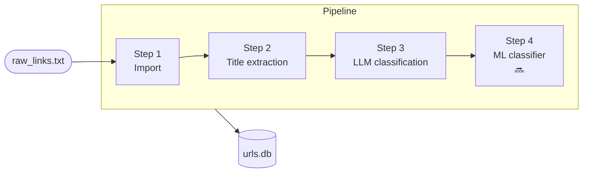
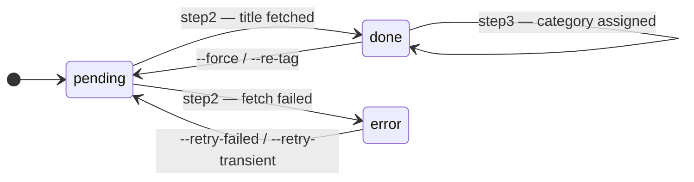
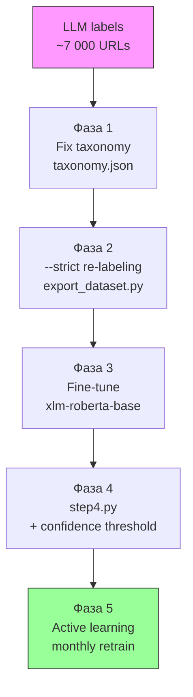
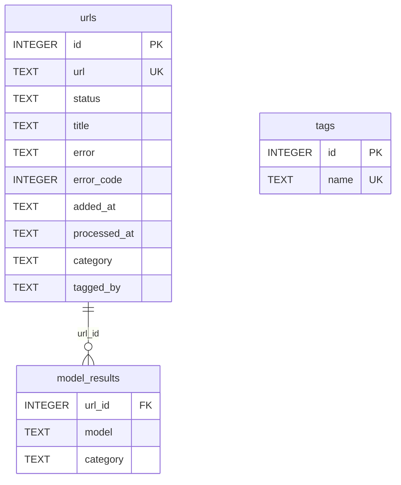

# URL Parser — LLM Classification Pipeline

Building a scalable URL classification pipeline: local LLM generates category labels from page titles, which then serve as training data for a fast downstream ML classifier.

---

## Problem

A growing collection of saved URLs — articles, repos, videos — with no structure. Manual tagging doesn't scale. External APIs cost money and require internet. The goal: a fully local, automated pipeline that turns raw links into a structured, searchable knowledge base.

## Approach

1. **Crawl** page titles from URLs (no headless browser — plain HTTP + `<title>`)
2. **Label** with a local LLM (Ollama) — no API keys, runs on GPU
3. **Fix** the taxonomy: define a closed category list, re-label with `--strict`
4. **Train** a lightweight ML classifier on the LLM-generated labels
5. **Infer** at 4000 URLs/2 sec — no GPU, no Ollama required

## Pipeline



---

## How it works

| Step | File | What happens |
|------|------|-------------|
| **Step 1** Import | `step1.py` | Regex extracts URLs from raw text, deduplicates, inserts with `status=pending` |
| **Step 2** Parse | `step2.py` | Fetches each URL, extracts `<title>`, sets `status=done` or `error` |
| **Step 3** Classify | `step3.py` | Sends `title + domain` to Ollama LLM, writes category to `urls.category` |
| **Step 4** ML *(coming)* | `step4.py` | Fine-tuned `xlm-roberta-base`, ~500 URLs/sec on CPU, fallback to LLM on low confidence |

**URL state machine:**



Each step is **idempotent** — re-running without flags skips already-processed URLs.

---

## Example output

```
URL:       https://habr.com/ru/articles/805105/
Title:     Как я построил RAG-систему для поиска по документам
Category:  Искусственный интеллект
Model:     mistral-small3.2:24b

URL:       https://github.com/BerriAI/litellm
Title:     LiteLLM — Call all LLM APIs using OpenAI format
Category:  Разработка

URL:       https://en.wikipedia.org/wiki/Transformer_(deep_learning)
Title:     Transformer (deep learning)
Category:  Data Science
```

Stats after a full run:

| Status | Count |
|--------|------:|
| done + classified | 6 901 |
| error (permanent 403/404) | 1 062 |
| Unique categories | ~85 (after cleanup) |

---

## ML Roadmap

The LLM pipeline generates training data for a fast offline classifier.



| Phase | Task | Status |
|-------|------|--------|
| 0 | Distribution analysis | ✅ done |
| 1 | Taxonomy fixation (`taxonomy.json`) | 🔄 in progress |
| 2.1 | `--strict` mode in step3 + re-label | ⏳ next |
| 2.2 | `export_dataset.py` | ⏳ |
| 2.3 | Manual validation (~50 examples/class) | ⏳ |
| 3 | `train_classifier.py`, `xlm-roberta-base` | ⏳ |
| 4 | `step4.py` + `--only-ml-classify` | ⏳ |
| 5 | Active learning, monthly retrain | ⏳ |

**Target:** `macro-F1 > 0.80`, inference without GPU or Ollama.

See [`docs/ml-plan.md`](docs/ml-plan.md) for full architecture details.

---

## Future work

- `--strict` mode — LLM chooses only from `taxonomy.json`, eliminates hallucinated categories
- `export_dataset.py` — export `(title, domain) → category` pairs as `dataset.jsonl`
- `--fix-category URL "Category"` — manual label correction for active learning
- `step4.py` — ML classifier with confidence fallback to LLM
- Active learning UI — surface low-confidence examples for review first

---

## Quick start

```bash
pip install -r requirements.txt

# Start Ollama (for classification)
ollama serve
ollama pull mistral-small3.2:24b

# Run full pipeline
python main.py

# Or step by step
python main.py --only-import
python main.py --only-parse --workers 4
python main.py --only-classify --model mistral-small3.2:24b --batch 10 --workers 4

# Test a single URL without touching the DB
python main.py --url https://habr.com/ru/articles/805105/ --dry-run
```

---

## Project structure

```
url-parser/
├── main.py             # entry point, CLI (argparse)
├── step1.py            # import URLs from file → DB
├── step2.py            # fetch <title> for each URL
├── step3.py            # LLM classification via Ollama
├── compare.py          # side-by-side model comparison
├── db.py               # all SQLite operations
├── config/
│   ├── settings.py     # delays, timeouts, Ollama host, token limits
│   └── prompts.py      # classification prompt templates
├── benchmark/
│   ├── benchmark.py    # find optimal batch/workers config
│   ├── benchmark_log.csv
│   └── dryrun_log.csv
├── docs/
│   ├── ml-plan.md      # ML classifier architecture & plan
│   ├── models-compare.md
│   └── backlog.md
├── requirements.txt
├── raw_links.txt       # input file
└── urls.db             # SQLite database (auto-created)
```

---

## Конфигурация

Все настройки вынесены в `config/` — редактируй эти файлы, не трогая код:

| Файл | Что настраивается |
|---|---|
| `config/settings.py` | путь к БД, задержки краулера, таймауты Ollama, токены, фильтры тегов |
| `config/prompts.py` | шаблоны промптов классификации (одиночный и батч) |

**Наиболее часто меняемые параметры** (`config/settings.py`):

```python
DELAY_MIN / DELAY_MAX          # пауза между HTTP-запросами (step2)
OLLAMA_HOST                    # адрес Ollama (по умолчанию localhost:11434)
OLLAMA_TEMPERATURE             # температура генерации (0.0 = детерминированный вывод)
NUM_PREDICT_SINGLE             # макс. токенов ответа на один URL (по умолчанию 80)
NUM_PREDICT_PER_URL            # то же для батча (по умолчанию 30 × кол-во URL)
MAX_CONSECUTIVE_CONN_ERRORS    # подряд ошибок Ollama → остановить (по умолчанию 3)
```

**Промпты** (`config/prompts.py`) — плейсхолдеры:
- `SINGLE` → `{title}`, `{hints_line}`
- `BATCH_HEADER` → `{hints_line}`
- `BATCH_ITEM` → `{i}`, `{title}`
- `HINTS_LINE` → `{hints}` (список категорий через запятую)

---

## Флаги

### Управление пайплайном

| Флаг | Что делает |
|---|---|
| `--only-import` | запустить только step1 (импорт URL) |
| `--only-parse` | запустить только step2 (парсинг заголовков) |
| `--only-classify` | запустить только step3 (классификация через Ollama) |
| `--re-tag` | сбросить `category`/`tagged_by` у всех done-URL и запустить step3 заново |

### Фильтрация и входные данные

| Флаг | Что делает |
|---|---|
| `--input FILE` | входной файл для step1 (по умолчанию: `raw_links.txt`) |
| `--url URL` | добавить один URL и обработать его (parse + запись в БД) |
| `--url URL --dry-run` | получить заголовок + категорию одного URL без записи в БД |
| `--domain DOMAIN` | обрабатывать только URL этого домена (нечувствительно к `www.` и регистру) |
| `--limit N` | обработать не более N URL за один запуск |
| `--force` | сбросить все записи в `pending` и начать заново |
| `--retry-failed` | повторить все URL со статусом `error` |
| `--retry-transient` | повторить только временные ошибки (5xx, 429, сетевые); пропустить постоянные (404, 403, 410) |

### Параллельность

| Флаг | Что делает | По умолчанию |
|---|---|---|
| `--workers N` | кол-во параллельных потоков | 1 |

- **Step2:** воркеры распределяются по доменам round-robin — одновременно идут только разные домены, снижая риск бана
- **Step3:** параллельные запросы к Ollama (для GPU-параллелизма также нужен `OLLAMA_NUM_PARALLEL=N`)

### Классификация (step3 / Ollama)

| Флаг | Что делает | По умолчанию |
|---|---|---|
| `--model MODEL` | модель Ollama | первая доступная |
| `--list-models` | показать список доступных моделей и выйти | — |
| `--batch N` | кол-во URL в одном запросе к модели (батчинг) | 1 |
| `--no-think` | отключить thinking-режим модели (`think: false`) | выкл. |

> `--no-think` нужен для thinking-моделей: `qwen3`, `deepseek-r1`, `minimax-m2` и др.

> `--batch` работает **только** со step3 (`--only-classify` / `--re-tag`).
> В режиме `--compare-models` батчинг не поддерживается.

### Управление тегами-подсказками

| Флаг | Что делает |
|---|---|
| `--add-tags TAGS` | добавить теги в справочник вручную (через запятую) |
| `--sync-tags` | импортировать теги из `category` в справочник и выйти |
| `--clear-tags` | очистить таблицу `tags` и выйти |

### Сравнение моделей

| Флаг | Что делает |
|---|---|
| `--compare-models M1 M2 …` | прогнать несколько моделей, результаты → `model_results` (не трогает `urls.category`) |
| `--compare-models … --workers N` | ускорить — N параллельных запросов внутри каждой модели |
| `--compare` | показать side-by-side таблицу результатов в терминале |
| `--compare --export FILE.csv` | то же + экспорт в CSV |
| `--compare --export-xlsx FILE.xlsx` | то же + экспорт в XLSX (жёлтые строки = расхождения между моделями) |
| `--accept-model MODEL` | скопировать результаты модели в `urls.category` (финальный выбор) |
| `--compare-clear` | очистить таблицу `model_results` |

### Диагностика и отладка

| Флаг | Что делает |
|---|---|
| `--stats` | показать статистику БД (total / pending / done / error / classified) и выйти |
| `--dry-run` | запустить step3 без записи в БД — вывести категории в консоль; логирует в `benchmark/dryrun_log.csv`; с `--url` — тест одного URL без изменений в БД |
| `--no-progress` | отключить progress bar, plain вывод (удобно для логов) |
| `-v, --verbose` | показывать заголовок / категорию / ошибку по каждому URL |

---

## Примеры

### Основной пайплайн

```bash
# Полный прогон
python main.py

# Другой входной файл, первые 100 URL
python main.py --input links.txt --limit 100

# Добавить и сразу обработать один URL (записывается в БД)
python main.py --url https://habr.com/ru/articles/805105/

# Протестировать один URL без записи в БД (parse + classify)
python main.py --url https://habr.com/ru/articles/805105/ --dry-run
python main.py --url https://habr.com/ru/articles/805105/ --dry-run --model mistral-small3.2:24b

# Только habr.com
python main.py --domain habr.com

# Повторить все ошибки
python main.py --retry-failed

# Повторить только временные ошибки (5xx/429/сетевые), пропустить 404/403/410
python main.py --retry-transient --workers 5

# Сбросить всё и начать заново
python main.py --force

# Параллельный парсинг — 4 потока, разные домены одновременно
python main.py --only-parse --workers 4
```

### Классификация

```bash
# Посмотреть доступные модели
python main.py --list-models

# Классифицировать конкретной моделью
python main.py --only-classify --model mistral-small3.2:24b

# Thinking-модели (qwen3, deepseek-r1, minimax-m2) — обязательно с --no-think
python main.py --only-classify --model qwen3:8b --no-think

# Батчинг + параллельность (быстрее на больших объёмах)
python main.py --only-classify --batch 10 --workers 4

# Перетэггировать всё другой моделью
python main.py --re-tag --model mistral-small3.2:24b
```

### Теги-подсказки

```bash
# Добавить начальные подсказки
python main.py --add-tags "python, machine learning, devops, frontend, security"

# Наполнить справочник из уже классифицированных URL
python main.py --sync-tags

# Полный сброс: очистить справочник + перетэггировать с нуля
python main.py --clear-tags && python main.py --re-tag
```

### Сравнение моделей

```bash
# Прогнать три модели
python main.py --compare-models llama3 mistral gemma2

# Только первые 20 URL конкретного домена
python main.py --compare-models llama3 mistral --domain habr.com --limit 20

# Посмотреть результаты
python main.py --compare

# Экспортировать в XLSX (жёлтые строки = расхождения, синяя шапка)
python main.py --compare --export-xlsx compare_results.xlsx

# Применить лучшую модель
python main.py --accept-model mistral-small3.2:24b
```

### Диагностика и отладка

```bash
# Статистика БД
python main.py --stats

# Проверить промпт на 20 URL без записи в БД
python main.py --only-classify --dry-run --limit 20

# Dry-run по конкретному домену
python main.py --only-classify --dry-run --domain habr.com --limit 50

# Plain вывод с деталями по каждому URL
python main.py --no-progress -v
```

---

## Производительность

| `--batch` | `--workers` | `OLLAMA_NUM_PARALLEL` | GPU utilization |
|:---------:|:-----------:|:---------------------:|:---------------:|
| 1 | 1 | 1 | ~5–10% (default) |
| 1 | 4 | 4 | ~30–50% |
| 10 | 4 | 4 | ~80–90% ✓ |
| 20 | 4 | 4 | ~85–95% |

> **Рекомендация:** начните с `--batch 10 --workers 4`.

```bash
# Найти оптимальный batch/workers для вашего железа
python benchmark/benchmark.py --model mistral-small3.2:24b --limit 30
```

Запустить Ollama с GPU-параллелизмом:

```bash
# Windows (PowerShell)
$env:OLLAMA_NUM_PARALLEL = 4; ollama serve

# Linux / macOS
OLLAMA_NUM_PARALLEL=4 ollama serve
```

---

## Схема БД



### Полезные SQL-запросы

```sql
-- Статистика по статусам
SELECT status, COUNT(*) FROM urls GROUP BY status;

-- Топ категорий
SELECT category, COUNT(*) FROM urls WHERE category IS NOT NULL
GROUP BY category ORDER BY COUNT(*) DESC LIMIT 20;

-- Только временные ошибки (можно ретраить)
SELECT url, error_code FROM urls
WHERE status = 'error' AND (error_code IS NULL OR error_code IN (429, 500, 502, 503, 504));

-- URL с присвоенными тегами
SELECT url, title, category, tagged_by FROM urls WHERE category IS NOT NULL;
```
