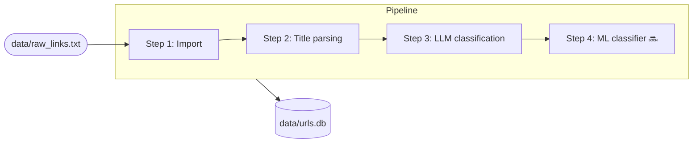
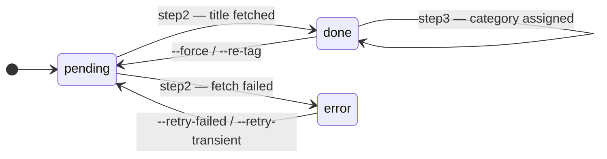
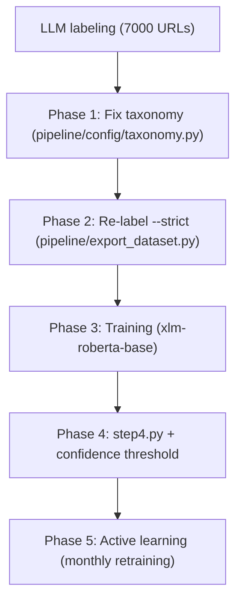
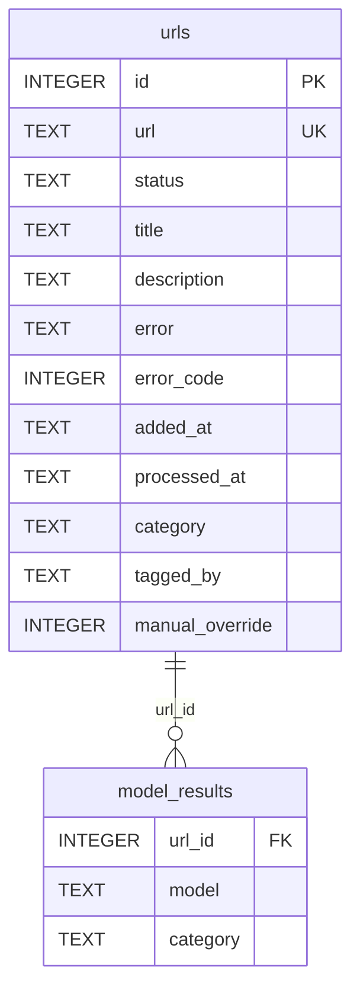

# Web Page Classification Pipeline

**Web scraping + LLM annotation pipeline** — a pipeline for collecting and classifying web pages. A local LLM (Ollama) determines the category based on title, description, and domain, generating a labeled dataset for training an ML classifier.

---

## Problem

Large collections of web links (articles, documentation, videos, repositories) quickly lose structure and become difficult to manage. Manual categorization does not scale, and using LLM directly for classification is slow and expensive.

The project goal is to create a local pipeline that automatically extracts page metadata, generates a labeled dataset, and trains a lightweight classifier for fast and scalable web content categorization.

## Use Cases

- **Personal knowledge base** — automatically categorize thousands of saved bookmarks
- **RSS / news feeds** — label article streams in real time
- **Corporate documentation** — automatic page classification by topic
- **Training dataset** — collect labeled data for downstream ML tasks

## Architecture

**Data enrichment pipeline** (Extract → Transform → Load) with idempotency and modularity:

1. **Extract** — parsing titles and meta-descriptions from pages (plain HTTP + `<title>`, `og:description`, `meta[name=description]`, bypass JS anti-bot challenges)
2. **Transform** — LLM annotation via Ollama (no API keys, GPU-powered). Fixed taxonomy: 31 categories in `pipeline/config/taxonomy.py`, LLM selects strictly from it
3. **Load** — writing to SQLite with states (pending/done/error)
4. **ML Training** *(planned)* — training `xlm-roberta-base` on labeled dataset, inference 4000 URLs/sec without GPU

## Pipeline



---

## How It Works

| Step | File | Phase | What happens |
|-----|------|------|----------------|
| **Step 1** Import | `pipeline/step1.py` | Load | Regex extracts URLs from text, deduplicates, adds to DB with `pending` status |
| **Step 2** Parsing | `pipeline/step2.py` | Extract + Transform | HTTP request → HTML parsing (`<title>`, `og:description`), bypass JS anti-bot (cookie `challenge_passed`). Status → `done` or `error` |
| **Step 3** Classification | `pipeline/step3.py` | Transform | `title + description + domain` → Ollama LLM → category. Writes to `urls.category`, `urls.tagged_by` |
| **Step 4** ML *(coming soon)* | `pipeline/step4.py` | Transform (Infer) | Fine-tuned `xlm-roberta-base`, ~500 URLs/sec on CPU, fallback to LLM on low confidence |

**URL state machine:**



Each step is **idempotent** — re-running without flags skips already processed URLs.

---

## Example Output

```
URL:       https://habr.com/ru/articles/805105/
Title:     How I built a RAG system for document search
Category:  Artificial Intelligence
Model:     mistral-small3.2:24b

URL:       https://github.com/BerriAI/litellm
Title:     LiteLLM — Call all LLM APIs using OpenAI format
Category:  Programming

URL:       https://en.wikipedia.org/wiki/Transformer_(deep_learning)
Title:     Transformer (deep learning)
Category:  Artificial Intelligence
```

Statistics after full run:

| Status | Count |
|--------|-------:|
| done + classified | ~6,050 |
| done, no category | ~1,570 |
| Unique categories | 31 (fixed taxonomy) |

---

## Model Selection

**7 Ollama models** were tested on real corpus (250 URLs, habr.com) for classification.

Each model was run through `--compare-models`, results saved to `model_results`. After run — side-by-side comparison of classifications via `--compare` and **agreement rate** calculation (share of URLs where model tag matched plurality across all models).

| Model | Agreement | Speed |
|--------|:---------:|:--------:|
| **mistral-small3.2:24b** | **54.8%** 🥇 | 1.2 sec/URL |
| qwen3-coder-next | 51.6% | 6.1 sec/URL |
| gemma2:9b | 49.2% | 0.16 sec/URL |
| cas/aya-expanse-8b | 43.6% | 0.14 sec/URL |
| mistral | 29.6% ❌ | 0.23 sec/URL |

`mistral` is disqualified: uses underscores (`machine_learning`) and mixes languages. Details: [`docs/discovery/models-compare.md`](docs/discovery/models-compare.md)

---

## ML Roadmap



| Phase | Task | Status |
|------|--------|--------|
| 0 | Distribution analysis | ✅ done |
| 1 | Fix taxonomy (`pipeline/config/taxonomy.py`) | ✅ done |
| 2.1 | `--strict` mode in step3 + re-label | ✅ done |
| 2.2 | `pipeline/export_dataset.py` | ⏳ |
| 2.3 | Manual validation (~50 examples/class) | ⏳ |
| 3 | `train_classifier.py`, `xlm-roberta-base` | ⏳ |
| 4 | `step4.py` + `--only-ml-classify` | ⏳ |
| 5 | Active learning, monthly retraining | ⏳ |

**Model features:** `f"{title} [SEP] {domain}"` — domain provides important context (`github.com` → code, `habr.com` → technical blog).

**Dataset:** ~7,000 labeled URLs, ~1,000 manually verified before training.

**Taxonomy (`pipeline/config/taxonomy.py`)** — 5 sections (L0), 31 categories (L1):
```python
TAXONOMY_SECTIONS = [
    ("IT and development",      [11 categories]),
    ("Management and business", [4 categories]),
    ("Science and education",   [3 categories]),
    ("Design and media",        [6 categories]),
    ("Other",                   [7 categories]),
]
# TAXONOMY — flat list of all 31 categories (auto-generated)
```

**Goal:** `macro-F1 > 0.80`, inference without GPU and Ollama.

Detailed architecture: [`docs/discovery/ml-plan.md`](docs/discovery/ml-plan.md)

---

## Domain Rules

For known domains, LLM can be bypassed or limited to a taxonomy section.
Rules are set in `pipeline/config/domain_rules.py`:

```python
DOMAIN_RULES = {
    # Category assigned directly — LLM is not called
    "youtube.com":       {"category": "Media and content"},
    "flibusta.is":       {"category": "Books"},

    # Section — LLM selects from 11 categories instead of 31
    "habr.com":          {"section": "IT and development"},

    # Both levels known — LLM is not called
    "github.com":        {"section": "IT and development", "category": "Programming"},
}
```

| Rule type | Behavior |
|---|---|
| `{"category": "..."}` | Category assigned directly, LLM is not called |
| `{"section": "..."}` | LLM gets shortened prompt — only section categories |
| `{"section": "...", "category": "..."}` | Category assigned directly (both levels known) |

Validation on import: category must be in `TAXONOMY`, section must be in `TAXONOMY_SECTIONS`.

---

## Development Plans

### Classification
- ~~`--strict` mode~~ — implemented: LLM selects only from `config/taxonomy.py` (31 categories)
- ~~Manual category editing~~ — implemented: Web UI → modal with taxonomy, `manual_override=1` protects from LLM overwrite
- `step4.py` — ML classifier (`xlm-roberta-base`) with fallback to LLM on low confidence
- Active learning UI — show examples with lowest model confidence first

### Hierarchical Taxonomy (L0 → L1 → L2)
Current classification is two-level: **L0 (sections)** → **L1 (categories)**. L0 sections are set in `TAXONOMY_SECTIONS` and used in sidebar, domain rules, and section-narrowed prompts. Next step — add L2:
```
L0: IT and development
  L1: Artificial Intelligence
    L2: LLM, Computer Vision, MLOps
  L1: Programming
    L2: Python, Go, Rust
```
Architecture: cascading classifiers (separate model per level) or multi-label approach.

### Feature Enrichment
Step2 extracts `<title>` and meta-description (`og:description` → `meta[name=description]`).
Description is passed to LLM prompt (step3) and will enter training dataset as additional feature.
Also planned:
- `<meta property="og:title">` — alternative title
- ML classifier input: `f"{title} [SEP] {description[:200]} [SEP] {domain}"`

This gives ML classifier more context and improves accuracy on pages with short or uninformative titles.

---

## Quick Start

```bash
pip install -r pipeline/requirements.txt

# Run Ollama
ollama serve
ollama pull mistral-small3.2:24b

# Full run
python pipeline/main.py

# Or step by step
python pipeline/main.py --only-import
python pipeline/main.py --only-parse --workers 4
python pipeline/main.py --only-classify --model mistral-small3.2:24b --workers 4

# Test single URL without DB write
python pipeline/main.py --url https://habr.com/ru/articles/805105/ --dry-run
```

### View Russian and English Documentation Simultaneously

This project maintains two versions of documentation: Russian (main development) and English (for public GitHub).

```bash
# Create separate folders for each version (git worktree)
git worktree add ../web-page-classifier-ru docs-ru

# Now open both folders in VS Code side-by-side:
# 📁 E:\My files\0 My_Dev\web-page-classifier\      ← master (ENGLISH)
# 📁 E:\My files\0 My_Dev\web-page-classifier-ru\   ← docs-ru (RUSSIAN)

# Or open in file explorer:
explorer "../web-page-classifier-ru"
```

**Result:** Two independent folders on disk containing Russian and English documentation versions from a single repository.

---

## Project Structure

```
web-page-classifier/
├── pipeline/
│   ├── main.py             # entry point, CLI (argparse)
│   ├── step1.py            # import URLs from file → DB
│   ├── step2.py            # fetch <title> + og:description for each URL
│   ├── step3.py            # LLM classification via Ollama
│   ├── compare.py          # side-by-side model comparison
│   ├── db.py               # all SQLite operations
│   ├── export_dataset.py   # export labeled data to JSONL
│   ├── train_classifier.py # fine-tune xlm-roberta-base
│   ├── config/
│   │   ├── settings.py     # delays, timeouts, Ollama host, token limits
│   │   ├── prompts.py      # classification prompt templates
│   │   ├── taxonomy.py     # 31 categories — single source of truth
│   │   └── domain_rules.py # rules by domain (skip LLM / narrow section)
│   ├── benchmark/
│   │   ├── benchmark.py    # find optimal batch/workers config
│   │   ├── benchmark_log.csv
│   │   └── dryrun_log.csv
│   └── requirements.txt
├── web/                    # Web UI (separate venv)
│   ├── app.py
│   ├── database.py
│   ├── routers/
│   ├── templates/
│   ├── static/
│   └── requirements.txt
├── data/                   # gitignored
│   ├── urls.db             # SQLite database (auto-created)
│   ├── raw_links.txt       # input file
│   ├── dataset.jsonl       # exported labeled data
│   ├── exports/            # CSV/XLSX exports
│   └── models/             # trained ML models
└── docs/
    ├── discovery/
    │   ├── ml-plan.md
    │   ├── models-compare.md
    │   └── backlog.md
    └── web/
        └── discovery/
            └── backlog.md
```

---

## Configuration

All settings are in `pipeline/config/` — edit these files, not the code:

| File | What's configured |
|---|---|
| `pipeline/config/settings.py` | DB path, crawler delays, Ollama timeouts, tokens, tag filters |
| `pipeline/config/prompts.py` | classification prompt templates (single and batch) |
| `pipeline/config/taxonomy.py` | 31 categories — model selects strictly from this list |
| `pipeline/config/domain_rules.py` | rules by domain: skip LLM or narrow prompt to section |

**Most frequently changed parameters** (`pipeline/config/settings.py`):

```python
DELAY_MIN / DELAY_MAX          # pause between HTTP requests (step2)
OLLAMA_HOST                    # Ollama address (default localhost:11434)
OLLAMA_TEMPERATURE             # generation temperature (0.0 = deterministic)
NUM_PREDICT_SINGLE             # max response tokens per URL (default 80)
NUM_PREDICT_PER_URL            # same for batch (default 30 × number of URLs)
MAX_CONSECUTIVE_CONN_ERRORS    # consecutive Ollama errors → stop (default 3)
```

**Prompts** (`pipeline/config/prompts.py`) — placeholders:
- `SINGLE` → `{title}`, `{hints_line}`
- `BATCH_HEADER` → `{hints_line}`
- `BATCH_ITEM` → `{i}`, `{title}`
- `HINTS_LINE` → `{hints}` (comma-separated category list)

---

## Flags

### Pipeline Control

| Flag | What it does |
|---|---|
| `--only-import` | run only step1 (URL import) |
| `--only-parse` | run only step2 (title parsing) |
| `--only-classify` | run only step3 (classification via Ollama) |
| `--refetch-description` | fill missing `description` for done URLs (doesn't touch `status` and `title`); idempotent — re-run gets only remaining empty |
| `--re-tag` | reset `category`/`tagged_by` for all done URLs and re-run step3 |

### Filtering and Input

| Flag | What it does |
|---|---|
| `--input FILE` | input file for step1 (default: `raw_links.txt`) |
| `--url URL` | add and process one URL (parse + DB write) |
| `--url URL --dry-run` | get title + category for one URL without DB write |
| `--domain DOMAIN` | process only URLs from this domain (case-insensitive, www-insensitive) |
| `--limit N` | process at most N URLs per run |
| `--force` | reset all records to `pending` and start over |
| `--retry-failed` | retry all URLs with `error` status |
| `--retry-transient` | retry only transient errors (5xx, 429, network); skip permanent (404, 403, 410) |

### Parallelism

| Flag | What it does | Default |
|---|---|---|
| `--workers N` | number of parallel threads | 1 |

- **Step2:** workers distributed by domain round-robin — only different domains run concurrently, reducing ban risk
- **Step3:** parallel Ollama requests (for GPU parallelism also set `OLLAMA_NUM_PARALLEL=N`)

### Classification (step3 / Ollama)

| Flag | What it does | Default |
|---|---|---|
| `--model MODEL` | Ollama model | first available |
| `--list-models` | show available models and exit | — |
| `--batch N` | number of URLs per model request (batching) | 1 |
| `--no-think` | disable model thinking mode (`think: false`) | off |
| `--no-description` | don't pass `og:description` in prompt (faster, ~50% fewer tokens) | off |

> `--no-think` needed for thinking models: `qwen3`, `deepseek-r1`, `minimax-m2`, etc.

> `--batch` works **only** with step3 (`--only-classify` / `--re-tag`).
> In `--compare-models` mode batching is not supported.

### Model Comparison

| Flag | What it does |
|---|---|
| `--compare-models M1 M2 …` | run multiple models, results → `model_results` (doesn't touch `urls.category`) |
| `--compare-models … --workers N` | speed up — N parallel requests per model |
| `--compare` | show side-by-side results table in terminal |
| `--compare --export FILE.csv` | same + export to CSV |
| `--compare --export-xlsx FILE.xlsx` | same + export to XLSX (yellow rows = model disagreements) |
| `--accept-model MODEL` | copy model results to `urls.category` (final choice) |
| `--compare-clear` | clear `model_results` table |

### Diagnostics and Debug

| Flag | What it does |
|---|---|
| `--stats` | show DB statistics (total / pending / done / error / classified) and exit |
| `--dry-run` | run step3 without DB write — output categories to console; logs to `pipeline/benchmark/dryrun_log.csv`; with `--url` — test one URL without DB changes |
| `--no-progress` | disable progress bar, plain output (good for logs) |
| `-v, --verbose` | show title / category / error for each URL |

---

## Examples

### Main Pipeline

```bash
# Full run
python pipeline/main.py

# Fill missing description for already processed URLs (doesn't re-parse title)
# Summary shows 3 lines: "Saved" / "No tag" / "HTTP error"
# Real coverage depends on sites: ~49% URLs have <meta description>
python pipeline/main.py --refetch-description --workers 4

# Same, only for one domain
python pipeline/main.py --refetch-description --domain habr.com --workers 4

# Different input file, first 100 URLs
python pipeline/main.py --input links.txt --limit 100

# Add and process one URL immediately (saved to DB)
python pipeline/main.py --url https://habr.com/ru/articles/805105/

# Test one URL without DB write (parse + classify)
python pipeline/main.py --url https://habr.com/ru/articles/805105/ --dry-run
python pipeline/main.py --url https://habr.com/ru/articles/805105/ --dry-run --model mistral-small3.2:24b

# Only habr.com
python pipeline/main.py --domain habr.com

# Retry all errors
python pipeline/main.py --retry-failed

# Retry only transient errors (5xx/429/network), skip 404/403/410
python pipeline/main.py --retry-transient --workers 5

# Reset everything and start over
python pipeline/main.py --force

# Parallel parsing — 4 threads, different domains concurrently
python pipeline/main.py --only-parse --workers 4
```

### Classification

```bash
# See available models
python pipeline/main.py --list-models

# Classify with specific model
python pipeline/main.py --only-classify --model mistral-small3.2:24b

# Thinking models (qwen3, deepseek-r1, minimax-m2) — must use --no-think
python pipeline/main.py --only-classify --model qwen3:8b --no-think

# Batching + parallelism (faster on large volumes)
python pipeline/main.py --only-classify --batch 10 --workers 4

# Without meta-description — faster, fewer tokens (for performance testing)
python pipeline/main.py --only-classify --no-description

# Re-tag everything with different model
python pipeline/main.py --re-tag --model mistral-small3.2:24b
```

### Model Comparison

```bash
# Run three models
python pipeline/main.py --compare-models llama3 mistral gemma2

# Only first 20 URLs of specific domain
python pipeline/main.py --compare-models llama3 mistral --domain habr.com --limit 20

# View results
python pipeline/main.py --compare

# Export to XLSX (yellow rows = disagreements, blue header)
python pipeline/main.py --compare --export-xlsx compare_results.xlsx

# Apply best model
python pipeline/main.py --accept-model mistral-small3.2:24b
```

### Diagnostics and Debug

```bash
# DB statistics
python pipeline/main.py --stats

# Test prompt on 20 URLs without DB write
python pipeline/main.py --only-classify --dry-run --limit 20

# Dry-run for specific domain
python pipeline/main.py --only-classify --dry-run --domain habr.com --limit 50

# Plain output with details per URL
python pipeline/main.py --no-progress -v
```

---

## Web UI

Separate sub-project for browsing and managing classified URLs in browser (mobile-first, Basic Auth).

Features:
- Browse by categories, recent feed (`/recent`), uncategorized (`/uncategorized`)
- Search by title / description / URL, sorting (newest / oldest / alphabetical)
- Manual category change (modal with taxonomy or drag & drop) — sets `manual_override=1`
- Processing (refetch title/description) via pipeline — single and bulk
- Bulk deletion

```bash
# Setup (separate venv)
cd web/
python -m venv venv
venv\Scripts\activate       # Windows
pip install -r requirements.txt

# Run from web/ folder
python -m uvicorn app:app --port 8000 --reload
# → http://localhost:8000
```

> Detailed docs: **[`web/README.md`](web/README.md)** · Development plan: **[`docs/web/discovery/backlog.md`](docs/web/discovery/backlog.md)**

---

## Performance

| `--batch` | `--workers` | `OLLAMA_NUM_PARALLEL` | GPU utilization | Quality |
|:---------:|:-----------:|:---------------------:|:---------------:|:--------:|
| 1 | 1 | 1 | ~5–10% (default) | high |
| 1 | 4 | 4 | ~30–50% ✓ | high |
| 10 | 4 | 4 | ~80–90% | medium (context bleed) |
| 20 | 4 | 4 | ~85–95% | low |

> **Recommendation:** `--workers 4` without `--batch` — each URL classified independently, 4 parallel Ollama requests. Batching saves time, but model can "contaminate" context from neighboring URLs.

```bash
# Find optimal batch/workers for your hardware
python pipeline/benchmark/benchmark.py --model mistral-small3.2:24b --limit 30
```

Run Ollama with GPU parallelism:

```bash
# Windows (PowerShell)
$env:OLLAMA_NUM_PARALLEL = 4; ollama serve

# Linux / macOS
OLLAMA_NUM_PARALLEL=4 ollama serve
```

---

## DB Schema



### Useful SQL Queries

```sql
-- Statistics by status
SELECT status, COUNT(*) FROM urls GROUP BY status;

-- Top categories
SELECT category, COUNT(*) FROM urls WHERE category IS NOT NULL
GROUP BY category ORDER BY COUNT(*) DESC LIMIT 20;

-- Only transient errors (retryable)
SELECT url, error_code FROM urls
WHERE status = 'error' AND (error_code IS NULL OR error_code IN (429, 500, 502, 503, 504));

-- URLs with assigned tags
SELECT url, title, category, tagged_by FROM urls WHERE category IS NOT NULL;
```
