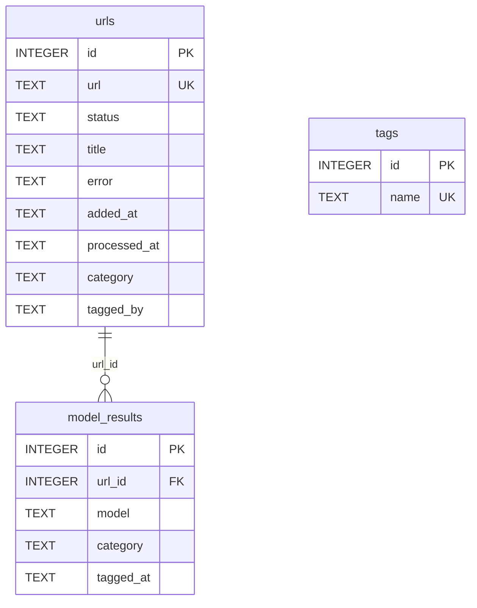
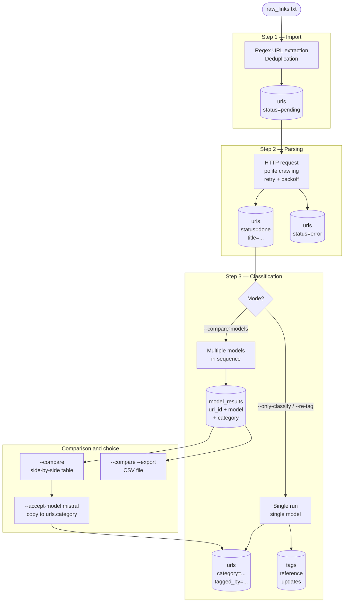
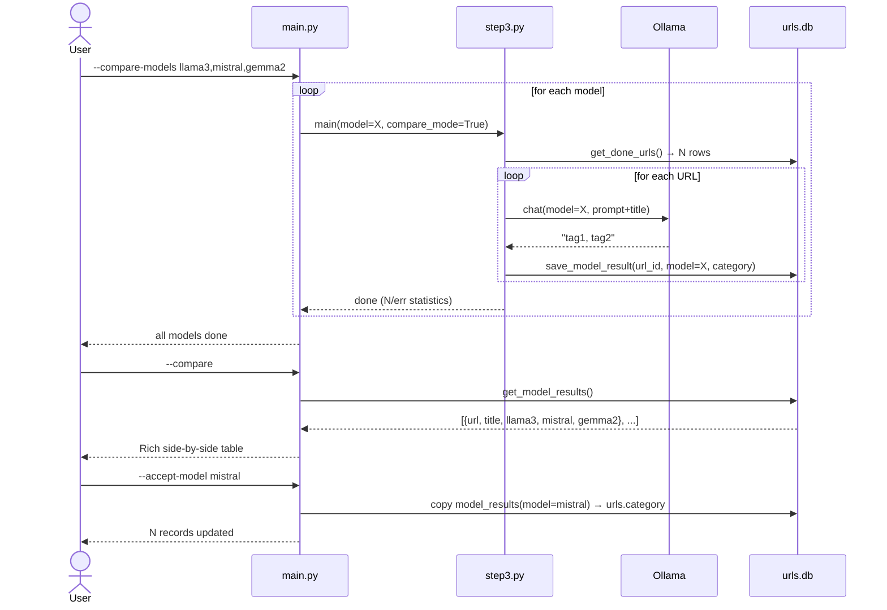
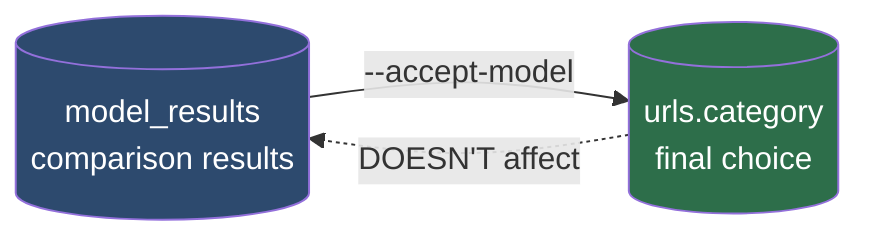

# Model Comparison — Architecture and Diagrams

Document describes architecture for running multiple Ollama models
on one URL set and comparing classification results.

---

## Complete Database Schema

### Tables and Relations



> **Key constraint:** `UNIQUE(url_id, model)` in `model_results` —
> re-running same model overwrites result (upsert).

---

## Data Lifecycle



---

## Model Comparison Process



---

## `model_results` Table Schema

```sql
CREATE TABLE model_results (
    id        INTEGER PRIMARY KEY AUTOINCREMENT,
    url_id    INTEGER NOT NULL REFERENCES urls(id) ON DELETE CASCADE,
    model     TEXT    NOT NULL,
    category  TEXT,
    tagged_at TEXT    DEFAULT (datetime('now')),
    UNIQUE(url_id, model)
);

CREATE INDEX idx_model_results_model ON model_results(model);
```

### Write Logic (upsert)

```sql
INSERT INTO model_results (url_id, model, category, tagged_at)
VALUES (?, ?, ?, datetime('now'))
ON CONFLICT(url_id, model)
DO UPDATE SET
    category  = excluded.category,
    tagged_at = excluded.tagged_at;
```

---

## Analysis SQL Queries

```sql
-- Side-by-side for first 20 URLs (pivot via GROUP BY + MAX CASE)
SELECT
    u.title,
    u.url,
    MAX(CASE WHEN mr.model LIKE '%llama3%'  THEN mr.category END) AS llama3,
    MAX(CASE WHEN mr.model LIKE '%mistral%' THEN mr.category END) AS mistral,
    MAX(CASE WHEN mr.model LIKE '%gemma%'   THEN mr.category END) AS gemma2
FROM urls u
JOIN model_results mr ON mr.url_id = u.id
GROUP BY u.id
LIMIT 20;

-- How many URLs each model processed
SELECT model, COUNT(*) AS cnt FROM model_results GROUP BY model;

-- URLs where models gave most different tags
SELECT u.url, u.title, COUNT(DISTINCT mr.category) AS unique_results
FROM urls u
JOIN model_results mr ON mr.url_id = u.id
GROUP BY u.id
HAVING unique_results > 1
ORDER BY unique_results DESC;

-- Most frequent tags from specific model
SELECT mr.model, tag.value AS tag, COUNT(*) AS freq
FROM model_results mr,
     json_each('["' || REPLACE(mr.category, ', ', '","') || '"]') AS tag
GROUP BY mr.model, tag.value
ORDER BY mr.model, freq DESC;
```

---

## CLI Flags

| Flag | Description |
|---|---|
| `--compare-models M1 M2 ...` | run multiple models, save to `model_results` (space or comma separated) |
| `--compare-models ... --domain D` | only URLs from specified domain |
| `--compare-models ... --limit N` | limit number of URLs |
| `--compare-models ... --workers N` | N parallel Ollama requests |
| `--compare` | show side-by-side Rich table results |
| `--compare --export FILE.csv` | export comparison to CSV |
| `--accept-model MODEL` | copy model results to `urls.category` |
| `--compare-clear` | clear `model_results` table |
| `--only-classify ... --batch N` | batching for normal classification (not for `--compare-models`) |

> **Flag conflicts:** `--compare-models` incompatible with `--only-classify`, `--only-parse`, `--only-import`, `--re-tag`. Program stops with explanation if tried together.

### Parallelism and Batching

`--workers` works for both `--compare-models` and `--only-classify`.
`--batch` available only for `--only-classify` and `--re-tag` (not for `--compare-models`).
For GPU parallelism on Ollama side, set `OLLAMA_NUM_PARALLEL=N` before `ollama serve`.

```bash
# Comparison with 4 parallel workers
python main.py --compare-models llama3 mistral --workers 4 --domain habr.com

# Normal classification with batching + parallelism
python main.py --only-classify --batch 10 --workers 4

set OLLAMA_NUM_PARALLEL=4  # (Windows, before ollama serve)
```

### Hang Protection

Each Ollama request limited by:
- `num_predict` — max tokens in response (80 for single URL, 30×N for batch of N URLs)
- `timeout=120s` — HTTP timeout on client side

If one batch hangs — other threads continue. After unlock, progress bar quickly catches up — normal behavior.

---

## Isolation: Experiments vs Final Choice



`model_results` and `urls.category` are **completely isolated**:
- `--compare-models` writes only to `model_results`, doesn't touch `urls.category`
- `--only-classify` writes only to `urls.category`, doesn't touch `model_results`
- Switch between them — only via explicit `--accept-model`

---

## Model Selection Criteria

### 1. Mandatory Conditions (knockout — disqualification on violation)

| Criterion | Threshold | Check |
|---|---|---|
| **Completeness** | 0 empty responses | `None` / empty string = invalid |
| **Tag language** | matches title language | Russian title → Russian tag (not `AI`, `DevOps`, etc.) |
| **No underscores** | 0 tags with `_` | `machine_learning` — disqualification |
| **Tag length** | 1–4 words | long phrases like `machine learning (Machine Learning)` — invalid |

> Models failing knockout excluded from ranking regardless of agreement rate.

---

### 2. Ranking Metrics

| Metric | Weight | Description |
|---|:-:|---|
| **Agreement rate** | 60% | Share of URLs where model tag matched plurality across all models (normalization: lowercase, no spaces) |
| **Case consistency** | 25% | % of tags in lowercase (or consistently one case) |
| **Speed** | 15% | Inverse of sec/URL; normalized across all candidates |

**Final score:** `score = agreement×0.6 + consistency×0.25 + speed×0.15`

---

### 3. Selection Procedure

```
1. Knockout filter      → remove models with critical violations
2. Run on ≥200 URLs     → small samples (<50) unrepresentative
3. Calculate final score
4. If difference <5%    → prefer faster model
5. Lock choice          → python main.py --accept-model <name>
```

---

### 4. Application to Current Runs

| Model | Knockout | Agreement | Case | Speed | **Result** |
|--------|:---:|:-:|:-:|:-:|:-:|
| mistral-small3.2:24b | ✅ | 54.8% | ⚠️ chaos | 1.2 sec/URL | **Select** |
| qwen3-coder-next | ✅ | 51.6% | ✅ | 6.1 sec/URL ❌ | candidate |
| gemma2:9b | ✅ | 49.2% | ⚠️ | 0.16 sec/URL | candidate |
| qwen2.5-coder:7b | ⚠️ mixes EN/RU | 45.6% | — | — | conditional |
| cas/aya-expanse-8b | ✅ | 43.6% | ✅ | 0.14 sec/URL | candidate |
| mistral | ❌ underscores | 29.6% | — | — | **disqualified** |
| phi4:14b | ⚠️ inconsistent case | 27.2% | — | — | conditional |

> **Current choice:** `mistral-small3.2:24b` — agreement rate leader. Case issue solved via post-processing normalization or per-model prompt (#52).

---

## Testing Results

### Methodology

| Parameter | Value |
|---|---|
| Corpus | habr.com |
| Prompt | rule-based + few-shot ("Act as professional technical librarian") |
| `temperature` | 0.0 (deterministic) |
| `--batch` | 1 (single requests) |
| `--workers` | 1 |

**"Agreement" metric** — share of URLs where model response matched plurality (most frequent category across all models for that URL, after normalization: lowercase, underscores removed).

---

### Run 1 — 09.03.2026, 30 URLs

**Command:**
```bash
python main.py --compare-models mistral-small3.2:24b mistral qwen2.5-coder:7b gemma2:9b aya-expanse:8b phi4:14b --limit 30
python main.py --compare --export-xlsx results.xlsx
```

| # | Model | Agreement | Underscores | Latin | Inconsistent Case | Conclusion |
|---|--------|:-:|:-:|:-:|:-:|---|
| 🥇 | **aya-expanse:8b** | **21/30 (70%)** | 0 | 3 | 3 | Leader: best accuracy + clean format |
| 🥈 | **mistral-small3.2:24b** | **20/30 (67%)** | 0 | 2 | 10 ⚠️ | Good accuracy, chaotic capitalization |
| 3 | gemma2:9b | 16/30 (53%) | 0 | 6 | 9 ⚠️ | Often "Product Management" instead of Russian variant |
| 3 | qwen3-coder-next | 16/30 (53%) | 0 | 2 | 2 | Clean format, but categories too general |
| 5 | qwen2.5-coder:7b | 15/30 (50%) | 0 | 6 | 3 | Mixes AI / ИИ / artificial intelligence variants |
| 6 | phi4:14b | 11/30 (37%) | 0 | 3 | 17 ❌ | Semantic errors + capitalization chaos |
| 7 | **mistral** | **10/30 (33%)** | 13 ❌ | 9 ❌ | 1 | Outlier: underscores + language mixing |

**Run 1 conclusion:** `aya-expanse:8b` — clear winner. `mistral` — clear outlier.

---

### Run 2 — 09.03.2026, 250 URLs

**Command:**
```bash
python main.py --compare-models mistral-small3.2:24b mistral qwen2.5-coder:7b gemma2:9b cas/aya-expanse-8b phi4:14b qwen3-coder-next --domain habr.com --limit 250 --workers 4
python main.py --compare --export-xlsx results2.xlsx
```

**Parameters:** `--workers 4`, `OLLAMA_NUM_PARALLEL=4` (default), `--domain habr.com`

| # | Model | Agreement | Time (4 threads) | sec/URL | Note |
|---|--------|:-:|:-:|:-:|---|
| 🥇 | **mistral-small3.2:24b** | **137/250 (54.8%)** | 0:04:59 | 1.2 | Leader on large sample |
| 🥈 | **qwen3-coder-next** | **129/250 (51.6%)** | 0:25:15 ⚠️ | 6.1 | Best in Qwen family, 25× slower than leader |
| 🥉 | gemma2:9b | 123/250 (49.2%) | 0:00:39 | 0.16 | |
| 4 | qwen2.5-coder:7b | 114/250 (45.6%) | 0:00:32 | 0.13 | Mixes `AI` / `ИИ` / Russian variants |
| 5 | cas/aya-expanse-8b | 109/250 (43.6%) | 0:00:35 | 0.14 | Dropped from 1st place (Run 1 unrepresentative) |
| 6 | mistral | 74/250 (29.6%) | 0:00:58 | 0.23 | Fragments tags via `_` and mixes languages |
| 7 | phi4:14b | 68/250 (27.2%) | 0:02:07 | 0.51 | Voice splits: `Artificial Intelligence` ≠ `artificial intelligence` |

**Consensus depth:**

| Models Agreed | URLs | % |
|:-:|:-:|:-:|
| 7 (full match) | 3 | 1.2% |
| 6 | 16 | 6.4% |
| 5 | 22 | 8.8% |
| 4 | 41 | 16.4% |
| 3 | 53 | 21.2% |
| 2 | 89 | 35.6% |
| 1 (no consensus) | 26 | 10.4% |

**Key Observations:**
- Run 1 (30 URLs) gave unrepresentative result: `aya-expanse` looked like leader on small sample, dropped to 5th on 250 URLs
- Low positions of `phi4` and `mistral` explained by taxonomy fragmentation (case/format), not understanding quality
- Case-insensitive normalization in agreement calculation would significantly improve `phi4`, `mistral`, `qwen2.5-coder` positions

**Run 2 conclusion:** `mistral-small3.2:24b` — leader. `phi4` and `mistral` — outliers due to unstable taxonomy.
