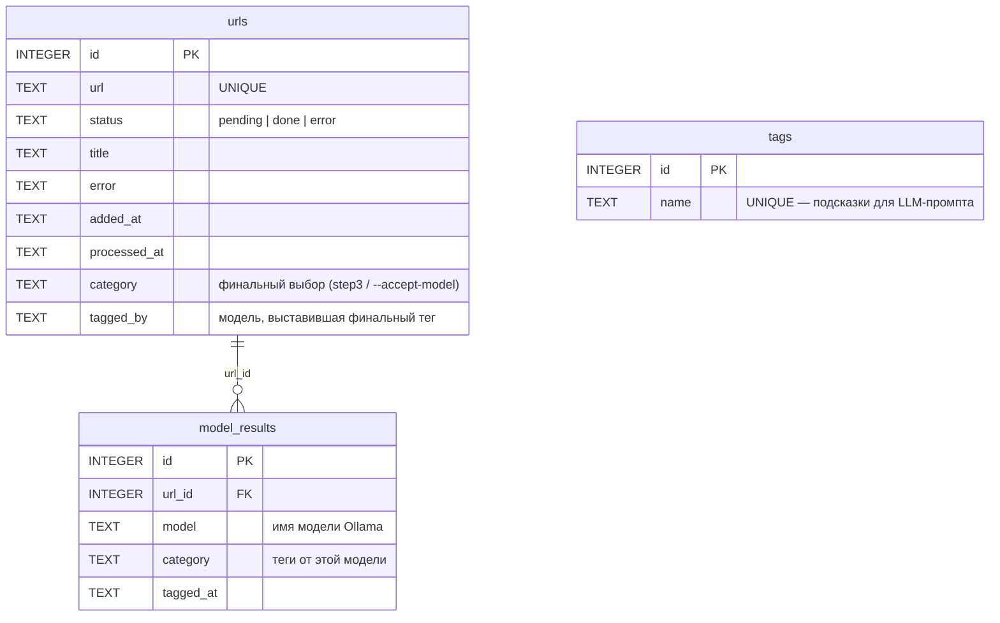
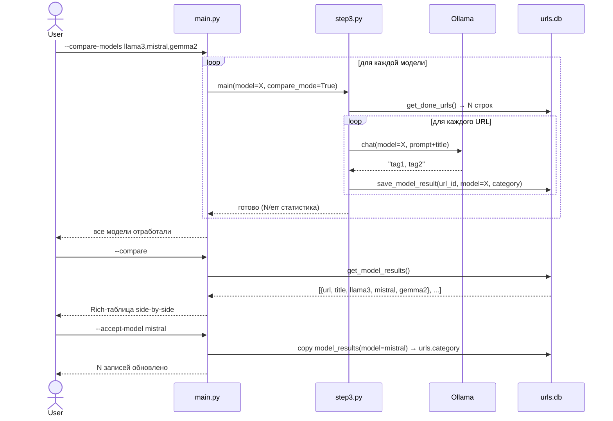
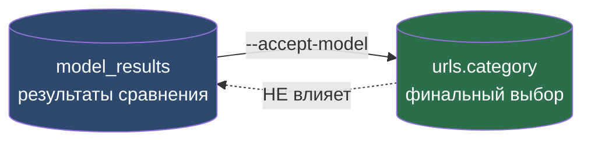

# Сравнение моделей — схема и диаграммы

Документ описывает архитектуру запуска нескольких Ollama-моделей
на одном наборе URL и сравнения результатов их классификации.

---

## Схема базы данных (полная)

### Таблицы и связи



> **Ключевой constraint:** `UNIQUE(url_id, model)` в `model_results` —
> повторный запуск той же модели перезаписывает результат (upsert).

---

## Жизненный цикл данных


---

## Процесс сравнения моделей



---

## Схема таблицы `model_results`

```sql
CREATE TABLE model_results (
    id        INTEGER PRIMARY KEY AUTOINCREMENT,
    url_id    INTEGER NOT NULL REFERENCES urls(id) ON DELETE CASCADE,
    model     TEXT    NOT NULL,
    category  TEXT,
    tagged_at TEXT    DEFAULT (datetime('now')),
    UNIQUE(url_id, model)
);

CREATE INDEX idx_model_results_model ON model_results(model);
```

### Логика записи (upsert)

```sql
INSERT INTO model_results (url_id, model, category, tagged_at)
VALUES (?, ?, ?, datetime('now'))
ON CONFLICT(url_id, model)
DO UPDATE SET
    category  = excluded.category,
    tagged_at = excluded.tagged_at;
```

---

## SQL-запросы для анализа

```sql
-- Side-by-side для первых 20 URL (pivot через GROUP BY + MAX CASE)
SELECT
    u.title,
    u.url,
    MAX(CASE WHEN mr.model LIKE '%llama3%'  THEN mr.category END) AS llama3,
    MAX(CASE WHEN mr.model LIKE '%mistral%' THEN mr.category END) AS mistral,
    MAX(CASE WHEN mr.model LIKE '%gemma%'   THEN mr.category END) AS gemma2
FROM urls u
JOIN model_results mr ON mr.url_id = u.id
GROUP BY u.id
LIMIT 20;

-- Сколько URL каждая модель обработала
SELECT model, COUNT(*) AS cnt FROM model_results GROUP BY model;

-- URL где модели дали наиболее разные теги
SELECT u.url, u.title, COUNT(DISTINCT mr.category) AS unique_results
FROM urls u
JOIN model_results mr ON mr.url_id = u.id
GROUP BY u.id
HAVING unique_results > 1
ORDER BY unique_results DESC;

-- Самые частые теги от конкретной модели
SELECT mr.model, tag.value AS tag, COUNT(*) AS freq
FROM model_results mr,
     json_each('["' || REPLACE(mr.category, ', ', '","') || '"]') AS tag
GROUP BY mr.model, tag.value
ORDER BY mr.model, freq DESC;
```

---

## Новые флаги CLI (планируемые)

| Флаг | Описание |
|---|---|
| `--compare-models M1,M2,...` | запустить несколько моделей, сохранить в `model_results` |
| `--compare` | показать side-by-side Rich-таблицу результатов |
| `--compare --export FILE.csv` | экспортировать сравнение в CSV |
| `--accept-model MODEL` | скопировать результаты модели в `urls.category` |
| `--compare-clear` | очистить таблицу `model_results` |

---

## Изоляция: эксперименты vs финальный выбор



`model_results` и `urls.category` **полностью изолированы**:
- `--compare-models` пишет только в `model_results`, не трогает `urls.category`
- `--only-classify` пишет только в `urls.category`, не трогает `model_results`
- Переход между ними — только явный `--accept-model`
