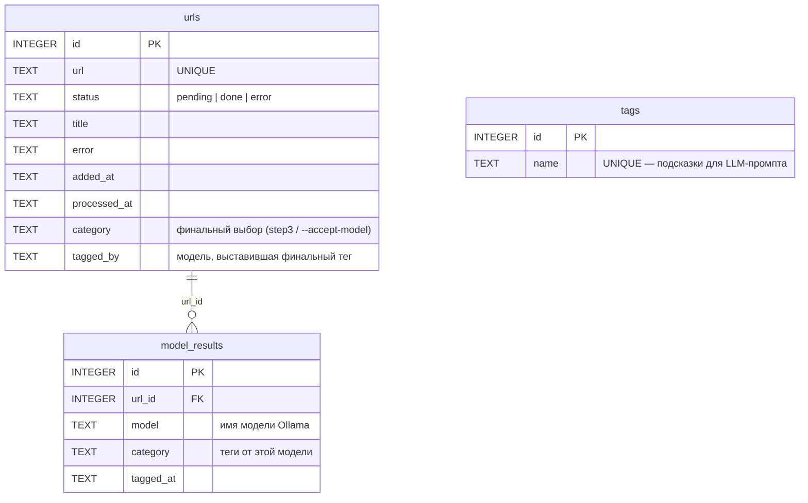
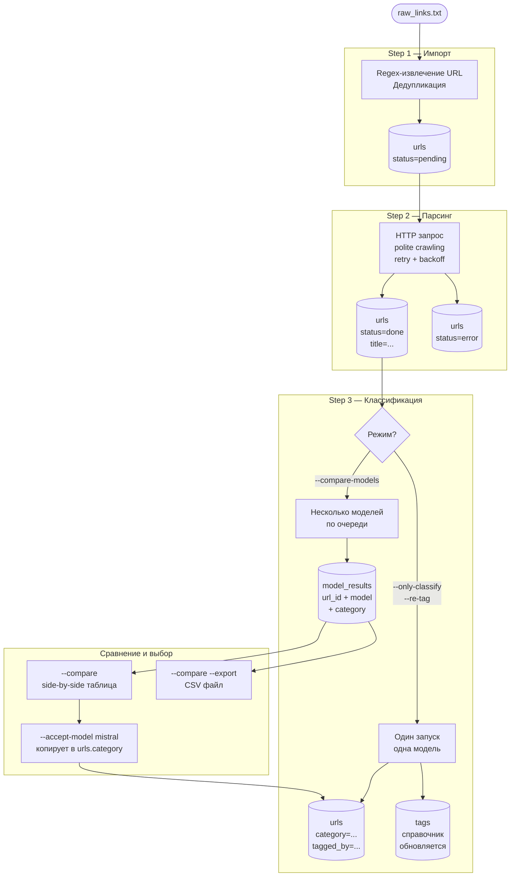
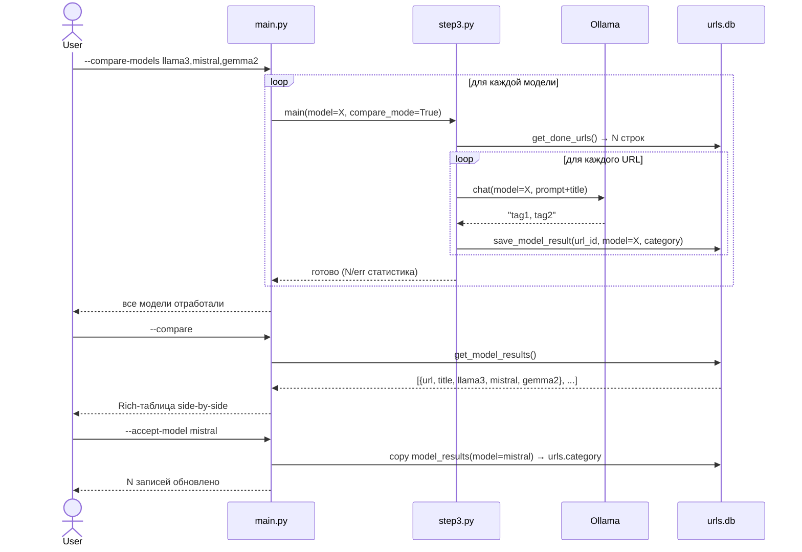
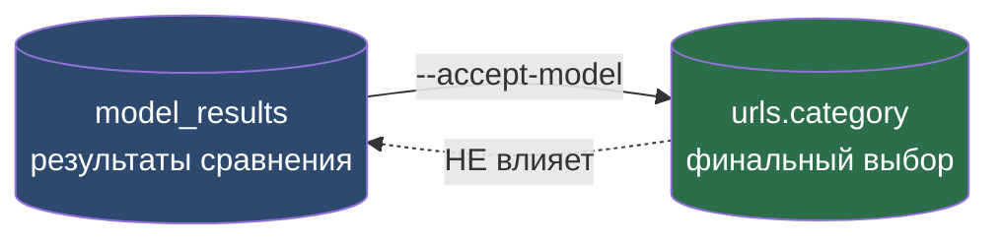

# Сравнение моделей — схема и диаграммы

Документ описывает архитектуру запуска нескольких Ollama-моделей
на одном наборе URL и сравнения результатов их классификации.

---

## Схема базы данных (полная)

### Таблицы и связи



> **Ключевой constraint:** `UNIQUE(url_id, model)` в `model_results` —
> повторный запуск той же модели перезаписывает результат (upsert).

---

## Жизненный цикл данных



---

## Процесс сравнения моделей



---

## Схема таблицы `model_results`

```sql
CREATE TABLE model_results (
    id        INTEGER PRIMARY KEY AUTOINCREMENT,
    url_id    INTEGER NOT NULL REFERENCES urls(id) ON DELETE CASCADE,
    model     TEXT    NOT NULL,
    category  TEXT,
    tagged_at TEXT    DEFAULT (datetime('now')),
    UNIQUE(url_id, model)
);

CREATE INDEX idx_model_results_model ON model_results(model);
```

### Логика записи (upsert)

```sql
INSERT INTO model_results (url_id, model, category, tagged_at)
VALUES (?, ?, ?, datetime('now'))
ON CONFLICT(url_id, model)
DO UPDATE SET
    category  = excluded.category,
    tagged_at = excluded.tagged_at;
```

---

## SQL-запросы для анализа

```sql
-- Side-by-side для первых 20 URL (pivot через GROUP BY + MAX CASE)
SELECT
    u.title,
    u.url,
    MAX(CASE WHEN mr.model LIKE '%llama3%'  THEN mr.category END) AS llama3,
    MAX(CASE WHEN mr.model LIKE '%mistral%' THEN mr.category END) AS mistral,
    MAX(CASE WHEN mr.model LIKE '%gemma%'   THEN mr.category END) AS gemma2
FROM urls u
JOIN model_results mr ON mr.url_id = u.id
GROUP BY u.id
LIMIT 20;

-- Сколько URL каждая модель обработала
SELECT model, COUNT(*) AS cnt FROM model_results GROUP BY model;

-- URL где модели дали наиболее разные теги
SELECT u.url, u.title, COUNT(DISTINCT mr.category) AS unique_results
FROM urls u
JOIN model_results mr ON mr.url_id = u.id
GROUP BY u.id
HAVING unique_results > 1
ORDER BY unique_results DESC;

-- Самые частые теги от конкретной модели
SELECT mr.model, tag.value AS tag, COUNT(*) AS freq
FROM model_results mr,
     json_each('["' || REPLACE(mr.category, ', ', '","') || '"]') AS tag
GROUP BY mr.model, tag.value
ORDER BY mr.model, freq DESC;
```

---

## Флаги CLI

| Флаг | Описание |
|---|---|
| `--compare-models M1 M2 ...` | запустить несколько моделей, сохранить в `model_results` (через пробел или запятую) |
| `--compare-models ... --domain D` | только для URL указанного домена |
| `--compare-models ... --limit N` | ограничить кол-во URL |
| `--compare-models ... --workers N` | N параллельных запросов к Ollama |
| `--compare` | показать side-by-side Rich-таблицу результатов |
| `--compare --export FILE.csv` | экспортировать сравнение в CSV |
| `--accept-model MODEL` | скопировать результаты модели в `urls.category` |
| `--compare-clear` | очистить таблицу `model_results` |
| `--only-classify ... --batch N` | батчинг для обычной классификации (не для `--compare-models`) |

> **Конфликты флагов:** `--compare-models` несовместим с `--only-classify`, `--only-parse`, `--only-import`, `--re-tag`. При попытке запустить их вместе программа остановится с объяснением.

### Параллелизм и батчинг

`--workers` работает как для `--compare-models`, так и для `--only-classify`.
`--batch` доступен только для `--only-classify` и `--re-tag` (не для `--compare-models`).
Для GPU-параллелизма на стороне Ollama установите `OLLAMA_NUM_PARALLEL=N` перед `ollama serve`.

```bash
# Сравнение с 4 параллельными воркерами
python main.py --compare-models llama3 mistral --workers 4 --domain habr.com

# Обычная классификация с батчингом + параллельностью
python main.py --only-classify --batch 10 --workers 4

set OLLAMA_NUM_PARALLEL=4  # (Windows, перед ollama serve)
```

### Защита от зависания

Каждый запрос к Ollama ограничен:
- `num_predict` — максимум токенов в ответе (80 для одиночного URL, 30×N для батча из N URL)
- `timeout=120s` — HTTP-таймаут на уровне клиента

Если один батч «завис» — остальные потоки продолжают работу. После разблокировки прогресс-бар быстро наверстает накопленную очередь — это нормальное поведение.

---

## Изоляция: эксперименты vs финальный выбор



`model_results` и `urls.category` **полностью изолированы**:
- `--compare-models` пишет только в `model_results`, не трогает `urls.category`
- `--only-classify` пишет только в `urls.category`, не трогает `model_results`
- Переход между ними — только явный `--accept-model`

---

## Критерии выбора модели

### 1. Обязательные условия (knockout — дисквалификация при нарушении)

| Критерий | Порог | Проверка |
|---|---|---|
| **Полнота** | 0 пустых ответов | `None` / пустая строка = недопустимо |
| **Язык тега** | совпадает с языком заголовка | RU-заголовок → RU-тег (не `AI`, `DevOps` и т.п.) |
| **Нет подчёркиваний** | 0 тегов с `_` | `машинное_обучение` — дисквалификация |
| **Длина тега** | 1–4 слова | длинные фразы типа `машинное обучение (Machine Learning)` — недопустимо |

> Модели, не прошедшие knockout, исключаются из ранжирования независимо от agreement rate.

---

### 2. Метрики ранжирования

| Метрика | Вес | Описание |
|---|:-:|---|
| **Agreement rate** | 60% | Доля URL, где тег модели совпал с plurality по всем моделям (нормализация: lowercase, без пробелов) |
| **Стабильность регистра** | 25% | % тегов в нижнем регистре (или стабильно в одном регистре) |
| **Скорость** | 15% | Обратная величина от с/URL; нормируется по всем кандидатам |

**Итоговый балл:** `score = agreement×0.6 + consistency×0.25 + speed×0.15`

---

### 3. Процедура выбора

```
1. Knockout-фильтр      → убрать модели с критическими нарушениями
2. Прогон на ≥200 URL   → малые выборки (<50) нерепрезентативны
3. Подсчёт итогового балла
4. При разнице <5%      → предпочесть более быструю модель
5. Зафиксировать выбор → python main.py --accept-model <имя>
```

---

### 4. Применение к текущим прогонам

| Модель | Knockout | Agreement | Регистр | Скорость | **Итог** |
|--------|:---:|:-:|:-:|:-:|:-:|
| mistral-small3.2:24b | ✅ | 54.8% | ⚠️ хаос | 1.2 с/URL | **Выбрать** |
| qwen3-coder-next | ✅ | 51.6% | ✅ | 6.1 с/URL ❌ | кандидат |
| gemma2:9b | ✅ | 49.2% | ⚠️ | 0.16 с/URL | кандидат |
| qwen2.5-coder:7b | ⚠️ мешает EN/RU | 45.6% | — | — | условно |
| cas/aya-expanse-8b | ✅ | 43.6% | ✅ | 0.14 с/URL | кандидат |
| mistral | ❌ подчёркивания | 29.6% | — | — | **дисквалифицирован** |
| phi4:14b | ⚠️ непост. регистр | 27.2% | — | — | условно |

> **Текущий выбор:** `mistral-small3.2:24b` — лидер по agreement rate. Проблема регистра решается post-processing нормализацией или per-model промптом (#52).

---

## Результаты тестирования

### Методология

| Параметр | Значение |
|---|---|
| Корпус | habr.com |
| Промпт | rule-based + few-shot («Act as professional technical librarian») |
| `temperature` | 0.0 (детерминированный) |
| `--batch` | 1 (одиночные запросы) |
| `--workers` | 1 |

**Метрика «Согласованность»** — доля URL, где ответ модели совпал с plurality (самой частой категорией среди всех моделей для данного URL, после нормализации: нижний регистр, убраны подчёркивания).

---

### Прогон 1 — 09.03.2026, 30 URL

**Команда:**
```bash
python main.py --compare-models mistral-small3.2:24b mistral qwen2.5-coder:7b gemma2:9b aya-expanse:8b phi4:14b --limit 30
python main.py --compare --export-xlsx results.xlsx
```

| # | Модель | Согласованность | Подчёркивания | Латиница | Непосл. заглавные | Вывод |
|---|--------|:-:|:-:|:-:|:-:|---|
| 🥇 | **aya-expanse:8b** | **21/30 (70%)** | 0 | 3 | 3 | Лидер: лучшая точность + чистый формат |
| 🥈 | **mistral-small3.2:24b** | **20/30 (67%)** | 0 | 2 | 10 ⚠️ | Хорошая точность, но хаотичная капитализация |
| 3 | gemma2:9b | 16/30 (53%) | 0 | 6 | 9 ⚠️ | Часто «Product Management» вместо рус. аналога |
| 3 | qwen3-coder-next | 16/30 (53%) | 0 | 2 | 2 | Чистый формат, но категории слишком общие |
| 5 | qwen2.5-coder:7b | 15/30 (50%) | 0 | 6 | 3 | Мешает ИИ / AI / искусственный интеллект |
| 6 | phi4:14b | 11/30 (37%) | 0 | 3 | 17 ❌ | Смысловые ошибки + хаос капитализации |
| 7 | **mistral** | **10/30 (33%)** | 13 ❌ | 9 ❌ | 1 | Аутсайдер: подчёркивания + мешает языки |

**Итог прогона 1:** `aya-expanse:8b` — явный победитель. `mistral` — явный аутсайдер.

---

### Прогон 2 — 09.03.2026, 250 URL

**Команда:**
```bash
python main.py --compare-models mistral-small3.2:24b mistral qwen2.5-coder:7b gemma2:9b cas/aya-expanse-8b phi4:14b qwen3-coder-next --domain habr.com --limit 250 --workers 4
python main.py --compare --export-xlsx results2.xlsx
```

**Параметры:** `--workers 4`, `OLLAMA_NUM_PARALLEL=4` (по умолчанию), `--domain habr.com`

| # | Модель | Согласованность | Время (4 потока) | с/URL | Примечание |
|---|--------|:-:|:-:|:-:|---|
| 🥇 | **mistral-small3.2:24b** | **137/250 (54.8%)** | 0:04:59 | 1.2 | Лидер на большой выборке |
| 🥈 | **qwen3-coder-next** | **129/250 (51.6%)** | 0:25:15 ⚠️ | 6.1 | Лучший в Qwen-семействе, но в 25× медленнее лидера |
| 🥉 | gemma2:9b | 123/250 (49.2%) | 0:00:39 | 0.16 | |
| 4 | qwen2.5-coder:7b | 114/250 (45.6%) | 0:00:32 | 0.13 | Мешает `AI` / `ИИ` / рус. варианты |
| 5 | cas/aya-expanse-8b | 109/250 (43.6%) | 0:00:35 | 0.14 | Упал с 1-го места (Прогон 1 был нерепрезентативен) |
| 6 | mistral | 74/250 (29.6%) | 0:00:58 | 0.23 | Фрагментирует теги через `_` и смешивает языки |
| 7 | phi4:14b | 68/250 (27.2%) | 0:02:07 | 0.51 | Дробит голос: `Искусственный интеллект` ≠ `искусственный интеллект` |

**Консенсус-глубина:**

| Моделей сошлось | URL | % |
|:-:|:-:|:-:|
| 7 (полное совпадение) | 3 | 1.2% |
| 6 | 16 | 6.4% |
| 5 | 22 | 8.8% |
| 4 | 41 | 16.4% |
| 3 | 53 | 21.2% |
| 2 | 89 | 35.6% |
| 1 (нет консенсуса) | 26 | 10.4% |

**Ключевые наблюдения:**
- Прогон 1 (30 URL) дал нерепрезентативный результат: `aya-expanse` на малой выборке выглядел лидером, на 250 URL опустился на 5-е место
- Низкие позиции `phi4` и `mistral` объясняются фрагментацией таксономии (case/формат), а не качеством понимания
- Case-insensitive нормализация при подсчёте agreement значительно улучшила бы позиции `phi4`, `mistral`, `qwen2.5-coder`

**Итог прогона 2:** `mistral-small3.2:24b` — лидер. `phi4` и `mistral` — аутсайдеры из-за нестабильной таксономии.
